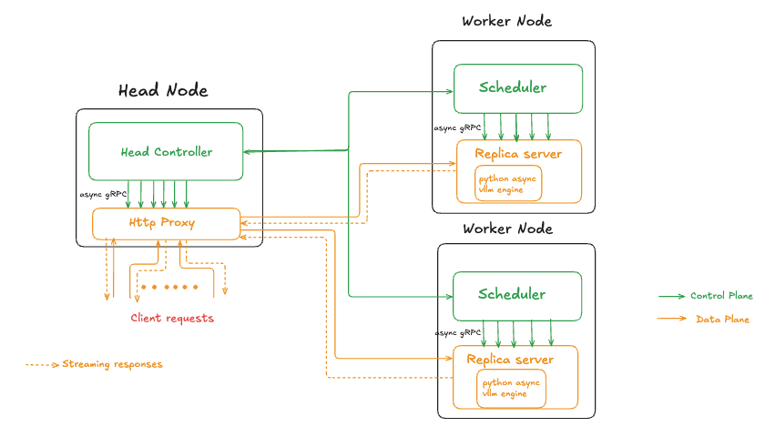

# Model Serving System

This project implements a **distributed model serving system** designed to efficiently manage and serve Large 
Language Models (LLMs). The design separates the data plane from the control plane: a C++ HTTP proxy handles client traffic and token streaming, while Python coordinates deployments, routing, health, and lifecycle. Built with **gRPC** for internal communication and **HTTP** for client interfaces, the system delivers robust fault tolerance, automatic restart capabilities, and flexible deployment options while successfully handling **1000+ concurrent users** with **100+ RPS sustained throughput**.

## What’s new
- C++ HTTP proxy replacing the Python proxy, providing lower overhead, faster time to first token, and steadier tail latency under load.
- Replica split: a C++ gRPC front (`replica_server.cc`) handles networking and streaming, while Python (`add_replica.py`) runs vLLM. This avoids GIL/event‑loop contention and scales concurrent streams more predictably.
- Clear planes: a direct data path (proxy → replica) for token streaming, and a control path (head controller → scheduler) for lifecycle, routing, and health.
- Improved observability: expanded Prometheus metrics at proxy and replica layers for capacity and SLO tracking.
- Performance: ~2.5× improvement in 95th‑percentile end-to-end latency, with smoother ramps

## Architecture
Clients send requests to the C++ HTTP proxy, which forwards them to replicas over gRPC and streams tokens back as they are produced. The head controller maintains deployment and routing state and distributes updates to the proxy. Schedulers on worker nodes start/register replicas and report health to the head controller.



### Components
- HTTP Proxy (C++): forwards requests to replicas and streams tokens to clients
- Head Controller (Python): deployments, routing updates, health, and VM management hooks
- Scheduler (Python, per worker): registers with the head controller, creates replicas, publishes health
- Replica (C++ + Python): C++ gRPC server with Python `add_replica.py` running vLLM for inference

## Key features
- Streaming inference: token by token responses and fast time to first token
- vLLM‑based replicas with asynchronous generation
- Health aware, least loaded routing, strict separation of data and control planes
- Prometheus metrics at proxy and replica layers
- Multi‑model support via JSON configuration

## Getting started

Quick example (AWS).

```bash
# Build and deploy
chmod +x scripts/aws_scripts/build-aws deploy/aws/deploy_prometheus
scripts/aws_scripts/build-aws
deploy/aws/deploy_prometheus

# Verify (replace host with your endpoint)
curl -N -X POST http://<host>:8000/v1/chat/tinyllama -H "Content-Type: text/plain" --data "What is machine learning."
```

Notes
- These scripts assume an AWS environment.
- When a local, non‑AWS bootstrap flow is available, it will be documented here.

## Using the API

Endpoints are per deployment. Use the deployment name as the URL path and send the prompt as plain text.

- Method: POST
- URL: `http://<host>:8000/<deployment_name>`
- Body: text/plain (prompt)
- Streaming: HTTP/1.1 chunked (use `curl -N`  for streaming output)

Available deployments:
- `http://localhost:8000/v1/chat/tinyllama`
- `http://localhost:8000/v1/chat/gpt2`
- `http://localhost:8000/v1/chat/phi2`

Examples:
```bash
# TinyLlama
curl -N -X POST http://localhost:8000/v1/chat/tinyllama \
  -H "Content-Type: text/plain" \
  --data "Explain machine learning"

# GPT-2
curl -N -X POST http://localhost:8000/v1/chat/gpt2 \
  -H "Content-Type: text/plain" \
  --data "The future of AI is"

# Phi-2
curl -N -X POST http://localhost:8000/v1/chat/phi2 \
  -H "Content-Type: text/plain" \
  --data "Write a short poem about rivers"
```

Notes:
- The set of available deployments is defined by the configuration (e.g., `model_configs.json`) and active routing from the head controller.
- Responses are streamed, clients should consume until connection close.


## Results: C++ vs. Python proxy 
| Metric/Aspect | Python proxy+Python replica(old) | C++ proxy + C++ replica(new) | Change |
|---|---|---|---|
| P95 end‑to‑end latency | ≈100 s | ≈40–42 s | ~2.5× faster |
| P50 end‑to‑end latency | ≈100 s (normal load) | ≈30–40 s in this run | ~2.5-3x faster |
| Throughput | Peak ≈100 RPS sustained | ≈40–70 RPS during ramps | lower peak, smoother ramps |
| Concurrency | Up to ~1000 users | Up to ~1000 users | parity |
| Failures | 0 | 0 | parity |
| Stability/Recovery | Spikes during load changes | Smoother recovery during ramps | improved behavior |

## Roadmap
- SLO‑aware autoscaling
- Persistent Storage
- Quantized inference (4‑/8‑bit)

## Additional resources
- Results: see `docs/results.pdf`
- Design document: see `docs/design_document.pdf` for detailed architecture and rationale


