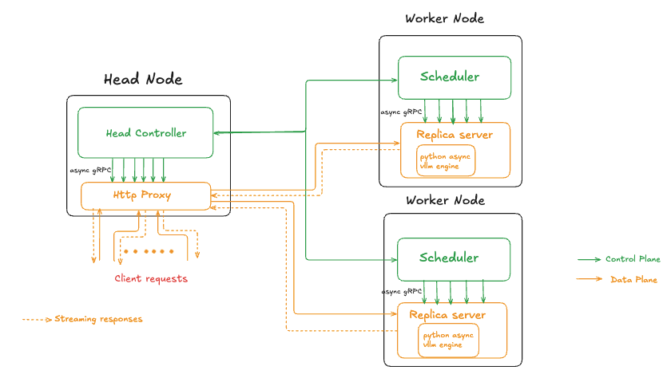

# Distributed LLM Serving Platform

A distributed LLM serving system for low-latency, streaming inference. The system separates the request-serving data plane from the orchestration control plane: a C++ HTTP proxy handles client-facing streaming traffic, while a Python head controller manages deployment state, routing metadata, replica lifecycle, health, and worker coordination.

The project explores the infrastructure problems behind production model serving systems: request routing, replica placement, health-aware load balancing, streaming backpressure, observability, fault recovery, and serving performance under high concurrency.

## Highlights

- Served 1,000+ concurrent clients with 100+ sustained RPS on 4 A10 GPUs
- Improved p95 latency by ~2.5x by moving the serving path from Python to C++
- Built a separated control/data plane architecture with direct proxy-to-replica gRPC streaming
- Implemented health-aware, least-loaded routing across vLLM replicas with Prometheus observability

The system was built in two iterations. V1 was a fully asynchronous Python system that validated the core architecture but hit GIL and event-loop bottlenecks under high concurrency. V2 moved the latency-sensitive serving path to C++ for the proxy and replica networking layer, reducing serving-path overhead and cutting p95 latency by ~2.5x.

For deeper technical write-ups:

- [V1: Building the serving system](https://vaishdho1.github.io/my-portfolio/llm-serving-system.html) 
- [V2: The C++ redesign](https://vaishdho1.github.io/my-portfolio/llm-serving-system2.html) 
- [`docs/design_document.pdf`](docs/design_document.pdf)
- [`docs/results.pdf`](docs/results.pdf)

## Motivation

Production LLM serving is not just model inference. A serving system must route requests across healthy replicas, keep tail latency stable under concurrency spikes, stream tokens with low time-to-first-token, and expose enough observability to debug throughput, latency, and failures.

Most serving frameworks hide these mechanisms behind a high-level API. This project implements them explicitly to understand what breaks at scale and why.

## Architecture

The system is organized into separate data plane and control plane components.



### Data plane

The data plane handles user requests and token streaming.

**C++ HTTP Proxy**

- Accepts client requests over HTTP
- Selects a healthy replica using local routing metadata
- Forwards requests to replicas over gRPC
- Streams generated tokens back to clients using HTTP chunked responses

**Replica Server**

- Uses a C++ gRPC server for request and streaming communication
- Runs vLLM generation in a Python model process
- Keeps latency-sensitive networking separate from Python model execution

### Control plane

The control plane manages deployment and cluster state.

**Head Controller**

- Tracks deployments, replicas, health, and routing state
- Publishes routing updates to proxies
- Coordinates with worker schedulers for replica lifecycle management

**Worker Scheduler**

- Runs on each worker node
- Registers available worker capacity with the head controller
- Starts model replicas
- Reports replica health and lifecycle status

## Core infrastructure problems

- **Control/data plane separation:** keeps deployment coordination out of the request-serving hot path.
- **Health-aware routing:** routes traffic only to live replicas using controller-published routing metadata.
- **Load-aware dispatch:** balances active requests across replicas to reduce hot spots.
- **Token streaming:** streams tokens over HTTP/gRPC instead of waiting for full generation.
- **Serving path optimization:** moves latency-sensitive networking from Python to C++.
- **Observability:** exposes metrics for throughput, latency, active requests, and replica health.

## Performance results

The system was evaluated under high-concurrency streaming workloads with up to 1,000 concurrent clients.

| Metric | Earlier Python proxy path | C++ proxy + C++ replica networking path | Result |
|---|---:|---:|---|
| P95 end-to-end latency | ~100s | ~40–42s | ~2.5x improvement |
| P50 end-to-end latency | ~100s under load | ~30–40s | ~2.5–3x improvement |
| Time to first token | queuing under high concurrency | ~100ms under 950 concurrent requests | near-zero proxy-to-replica queuing |
| Concurrent clients | ~1,000 | ~1,000 | maintained concurrency |
| Failure rate | 0 observed failures | 0 observed failures | stable under test |
| Ramp behavior | latency spikes during load changes | smoother recovery during ramps | improved tail behavior |

The C++ path was optimized for lower tail latency and smoother streaming behavior under ramping load, rather than maximizing raw peak RPS in this benchmark.

## Design tradeoffs

- **Direct proxy-to-replica data path:** V1 routed requests through the scheduler, which became a bottleneck under high concurrency. V2 routes directly from proxy to replicas using controller-published routing metadata, keeping the scheduler out of the serving hot path.

- **C++ serving path with Python model execution:** V1 used Python for proxy and replica networking, which hit GIL and event-loop bottlenecks under load. V2 moved latency-sensitive networking to C++ using Boost.Asio and C++23 coroutines, while keeping vLLM generation in Python.

- **Scheduler as control plane only:** V1 coupled scheduling with live inference traffic. V2 keeps the scheduler responsible for replica lifecycle and health reporting, while the proxy handles request routing directly.

## Current limitations and future work

- SLO-aware autoscaling and token-aware scheduling
- Backpressure and admission control during overload
- Multi-GPU and multi-node model parallel serving
- Pluggable cluster scheduler for heterogeneous placement across GPU/TPU resources
- Mixed workload scheduling for inference, training, and fine-tuning jobs
- Persistent deployment state for controller fault recovery

## Getting started

Quick example on AWS:

```bash
# Build and deploy
chmod +x scripts/aws_scripts/build-aws deploy/aws/deploy_prometheus
scripts/aws_scripts/build-aws
deploy/aws/deploy_prometheus

# Verify serving
curl -N -X POST http://<host>:8000/v1/chat/tinyllama \
  -H "Content-Type: text/plain" \
  --data "What is machine learning?"
```
